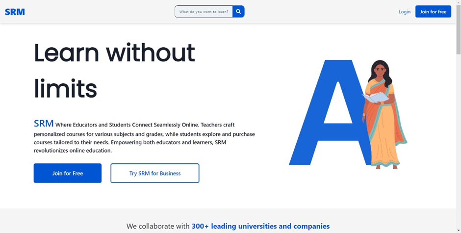
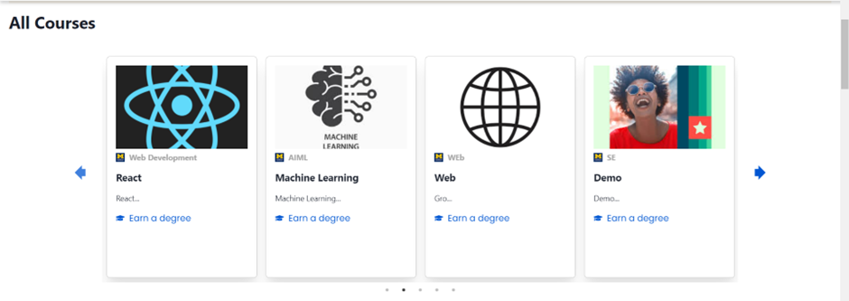
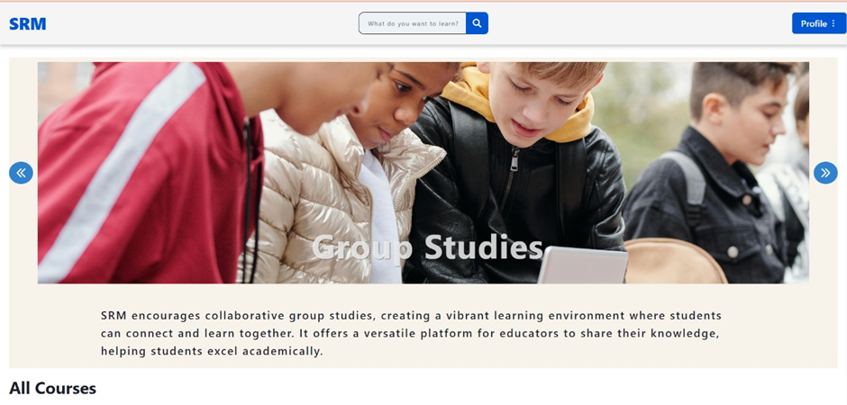
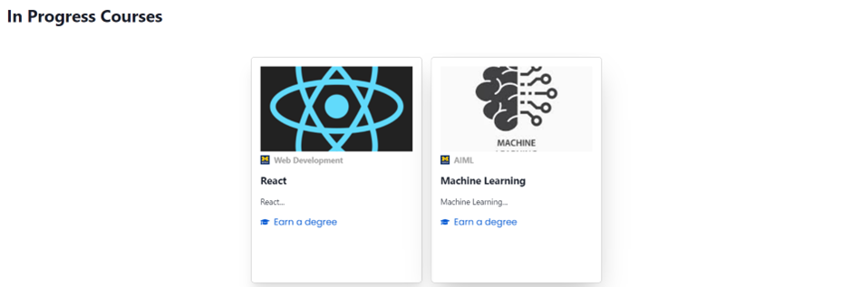
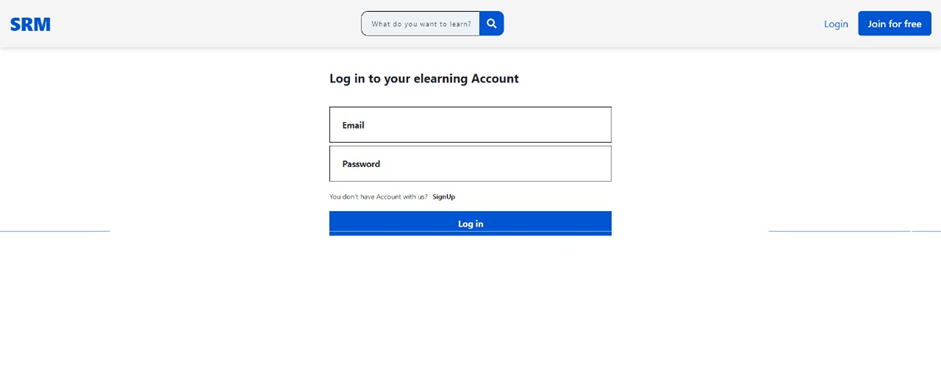
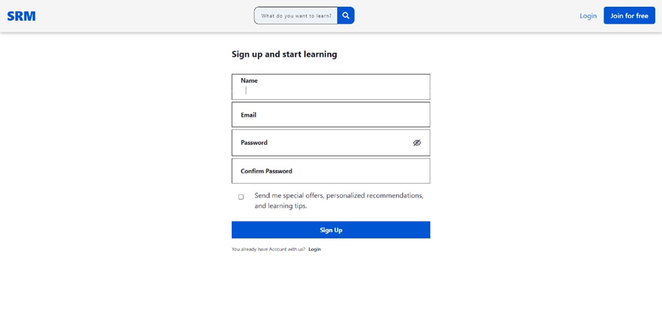

# 🎓 E-Learning Platform (MERN Stack)

A full-stack E-Learning platform built with the **MERN stack** (MongoDB, Express.js, React, Node.js) featuring course management, video lessons, quizzes, AI-powered chatbot assistant, and certificate generation.

---

## 📚 Table of Contents

- [Features](#features)
- [Tech Stack](#tech-stack)
- [Project Structure](#project-structure)
- [Getting Started](#getting-started)
  - [Prerequisites](#prerequisites)
  - [Installation](#installation)
  - [Environment Variables](#environment-variables)
  - [Running the Application](#running-the-application)
- [Features Overview](#features-overview)
  - [User Roles](#user-roles)
  - [Course Management](#course-management)
  - [Quiz System](#quiz-system)
  - [Certificate System](#certificate-system)
  - [AI Assistant](#ai-assistant)
  - [Payment Integration](#payment-integration)
- [API Endpoints](#api-endpoints)
- [Screenshots](#screenshots)
- [Contributing](#contributing)
- [License](#license)

---

## ✨ Features

### 👤 User Features
- Browse and search courses with category filters
- Enroll in courses (free/paid)
- Watch video lessons with a built-in player
- Complete lesson quizzes with instant feedback
- Track learning progress with "In Progress" courses
- Earn certificates upon course completion (≥80% average quiz score)
- Download certificates as PNG images
- Profile management (name, email, password, age, city, job)
- AI Assistant for course-related questions

### 👨‍🏫 Teacher Features
- Create and manage courses
- Add video lessons to courses
- Create quizzes for each video lesson
- Upload course materials (PDF) for AI training
- Track course approval status (pending/published/rejected)
- Edit and delete own courses

### 🛡️ Admin Features
- Full CRUD operations on courses, users, and videos
- Approve/reject teacher-created courses
- Manage all users with role assignment
- View statistics and system analytics
- Upload course PDF materials for AI training
- Manage discounts, gift cards, and system settings

### 🤖 AI Assistant (Gemini-powered)
- Context-aware Q&A based on course materials
- RAG (Retrieval-Augmented Generation) with strict scope control
- Support for PDF upload → text extraction → AI training
- Vietnamese language support
- Only answers within course content (anti-hallucination)

### 🎓 Certificate System
- Auto-issue certificates when user completes all quizzes
- Minimum 80% average score required
- Unique certificate ID and number generation
- View all earned certificates on dedicated page
- Download certificates as high-resolution PNG images
- Certificate eligibility progress tracking

---

## 🛠️ Tech Stack

### Frontend
| Technology | Purpose |
|------------|---------|
| **React 18** | UI library |
| **React Router v6** | Client-side routing |
| **Redux** | State management |
| **Chakra UI** | Component library & styling |
| **Axios** | HTTP client |
| **React Player** | Video playback |
| **React Markdown** | Markdown rendering (AI chat) |
| **html2canvas** | Certificate PNG export |
| **Chart.js** | Admin statistics |
| **Tailwind CSS** | Utility CSS |

### Backend
| Technology | Purpose |
|------------|---------|
| **Node.js + Express.js** | Server framework |
| **MongoDB + Mongoose** | Database & ODM |
| **JWT** | Authentication |
| **Google Gemini AI** | AI Assistant |
| **Multer** | File upload handling |
| **pdf-parse** | PDF text extraction |
| **Bcrypt** | Password hashing |

---

## 📁 Project Structure

```
├── backend/
│   ├── data/                    # Course material files for AI (text format)
│   ├── helpers/
│   │   ├── aiAssistant.helper.js   # Gemini AI integration with RAG
│   │   └── courseAccess.js         # Course enrollment access control
│   ├── middlewares/
│   │   └── users.middleware.js     # JWT authentication middleware
│   ├── models/
│   │   ├── certificate.model.js    # Certificate schema
│   │   ├── courses.model.js        # Course schema
│   │   ├── quiz.model.js           # Quiz schema
│   │   ├── submission.model.js     # Quiz submission schema
│   │   ├── users.models.js         # User schema
│   │   └── video.model.js          # Video schema
│   ├── routes/
│   │   ├── aiAssistant.route.js    # AI chat & PDF upload endpoints
│   │   ├── certificate.route.js    # Certificate issue & list endpoints
│   │   ├── courses.route.js        # Course CRUD endpoints
│   │   ├── payment.route.js        # Payment integration
│   │   ├── quiz.route.js           # Quiz CRUD & submission
│   │   ├── users.routes.js         # User auth & profile
│   │   └── videos.route.js         # Video CRUD
│   ├── uploads/                    # Temporary upload directory
│   ├── index.js                    # Express app entry point
│   ├── db.js                       # MongoDB connection
│   ├── blacklist.js                # JWT blacklist (logout)
│   └── package.json
│
├── frontend/
│   ├── public/                     # Static files
│   ├── src/
│   │   ├── Pages/
│   │   │   ├── LandingPage.jsx         # Homepage
│   │   │   ├── UserDashboard.jsx       # User dashboard
│   │   │   ├── CourseLearnPage.jsx     # Course learning (video + quiz + AI + cert)
│   │   │   ├── CourseEnrollPage.jsx    # Course enrollment
│   │   │   ├── CertificatesPage.jsx    # Certificate listing & download
│   │   │   ├── ProfilePage.jsx         # User profile edit
│   │   │   └── Footer.jsx             # Footer component
│   │   ├── components/
│   │   │   ├── UserComponents/
│   │   │   │   ├── AllCoursesGrid.jsx   # All courses grid with pagination
│   │   │   │   ├── CourseComponent.jsx  # Course sections layout
│   │   │   │   ├── InProgressCarousel.jsx
│   │   │   │   └── Dropdown.jsx         # User profile dropdown
│   │   │   ├── AIAssistantChat.jsx      # AI chat widget
│   │   │   ├── AdminUploadPDFContext.jsx # PDF upload widget
│   │   │   └── Adminitems/             # Admin components
│   │   │   └── TeacherComponents/      # Teacher components
│   │   ├── Redux/                       # Redux store & slices
│   │   ├── routes/
│   │   │   ├── AllRoute.jsx            # Route definitions
│   │   │   ├── PrivateRoutes.jsx       # Auth guard
│   │   │   ├── AdminRoute.jsx          # Admin guard
│   │   │   └── TeacherRoute.jsx        # Teacher guard
│   │   └── config/
│   │       └── api.js                  # API base URL config
│   └── package.json
│
├── screenshots/                    # Application screenshots
└── README.md                       # This file
```

---

## 🚀 Getting Started

### Prerequisites

- **Node.js** v16+ (recommended: v20)
- **MongoDB** (local or Atlas)
- **npm** or **yarn**
- **Gemini API Key** (for AI Assistant)

### Installation

```bash
# 1. Clone the repository
git clone https://github.com/your-username/elearning-platform.git
cd elearning-platform

# 2. Install backend dependencies
cd backend
npm install

# 3. Install frontend dependencies
cd ../frontend
npm install
```

### Environment Variables

**Backend** — Create `backend/.env`:

```env
PORT=5001
MONGODB_URI=mongodb+srv://<user>:<password>@cluster.mongodb.net/elearning
JWT_SECRET=your_jwt_secret_here
GEMINI_API_KEY=your_gemini_api_key_here
```

> Get a Gemini API key from: https://aistudio.google.com/apikey

**Frontend** — Create `frontend/.env`:

```env
REACT_APP_API_URL=http://localhost:5001
```

### Running the Application

```bash
# Terminal 1: Start Backend (port 5001)
cd backend
npm run server

# Terminal 2: Start Frontend (port 3000)
cd frontend
npm start
```

The app will be available at **http://localhost:3000** 🎉

---

## 📖 Features Overview

### User Roles

| Role | Capabilities |
|------|-------------|
| **User** | Browse courses, enroll, watch videos, take quizzes, earn certificates, use AI Assistant |
| **Teacher** | All user features + create/manage courses, add videos/quizzes, upload PDF materials |
| **Admin** | All features + approve/reject courses, manage users, view statistics, system settings |

### Course Management

1. **Teachers** create courses → status is **"pending"**
2. **Admins** review and **approve** (→ "published") or **reject** (→ "rejected")
3. Once published, courses appear in the **"All Courses"** grid on User Dashboard
4. Users can click a course → view details → enroll → start learning

### Quiz System

- Each video lesson can have an associated quiz
- Teachers create quizzes via the `Lesson quiz` button in course management
- Students answer multiple-choice questions and get instant results
- Best score per video is recorded for certificate eligibility

### Certificate System

1. Complete **all quizzes** in a course
2. Achieve **≥80% average score** across all quizzes
3. Click **"Get My Certificate"** on the Course Learn page
4. View all certificates at `/certificates`
5. Download any certificate as a **PNG image** with a professional design

### AI Assistant

- Powered by **Google Gemini 2.5 Flash**
- Uses **RAG (Retrieval-Augmented Generation)** — only answers from uploaded course materials
- Teachers upload PDF → text is extracted → stored as course context
- Students ask questions in the **AI Assistant tab** during a course
- Supports Vietnamese language
- Strict scope control prevents off-topic answers

---

## 🌐 API Endpoints

### Authentication
| Method | Endpoint | Description |
|--------|----------|-------------|
| POST | `/users/signup` | Register new user |
| POST | `/users/login` | User login |
| POST | `/users/logout` | User logout |

### Courses
| Method | Endpoint | Description |
|--------|----------|-------------|
| GET | `/courses/all` | Get all published courses |
| GET | `/courses/:id` | Get single course details |
| POST | `/courses/add` | Create course (admin/teacher) |
| PATCH | `/courses/update/:id` | Update course |
| DELETE | `/courses/delete/:id` | Delete course |
| PATCH | `/courses/approve/:id` | Approve course (admin) |
| PATCH | `/courses/reject/:id` | Reject course (admin) |

### Videos
| Method | Endpoint | Description |
|--------|----------|-------------|
| GET | `/videos/courseVideos/:courseId` | Get videos for a course |
| POST | `/videos/add` | Add video |
| PATCH | `/videos/update/:id` | Update video |
| DELETE | `/videos/delete/:id` | Delete video |

### Quizzes
| Method | Endpoint | Description |
|--------|----------|-------------|
| POST | `/quizzes/` | Create/update quiz |
| GET | `/quizzes/video/:videoId` | Get quiz (without answers) |
| POST | `/quizzes/video/:videoId/submit` | Submit quiz answers |

### Certificates
| Method | Endpoint | Description |
|--------|----------|-------------|
| POST | `/certificate/issue/:courseId` | Issue certificate |
| GET | `/certificate/list` | List user's certificates |
| GET | `/certificate/check/:courseId` | Check eligibility |
| GET | `/certificate/:id` | Get certificate details |

### AI Assistant
| Method | Endpoint | Description |
|--------|----------|-------------|
| POST | `/ai-assistant/ask` | Ask AI about course content |
| POST | `/ai-assistant/upload-pdf` | Upload PDF material |

### Users
| Method | Endpoint | Description |
|--------|----------|-------------|
| PATCH | `/users/update/:id` | Update user profile |
| GET | `/users/enrollment/:courseId` | Check enrollment status |

---

## 📸 Screenshots

| Page | Screenshot |
|------|-----------|
| Home Page |  |
| All Courses |  |
| User Dashboard |  |
| Enrolled Courses |  |
| Admin Dashboard |  |
| Login |  |
| Sign Up |  |

---

## 🤝 Contributing

1. Fork the repository
2. Create your feature branch: `git checkout -b feature/amazing-feature`
3. Commit your changes: `git commit -m 'Add amazing feature'`
4. Push to the branch: `git push origin feature/amazing-feature`
5. Open a Pull Request

---

## 📄 License

This project is for academic purposes at **Ho Chi Minh City University of Education (HCMUE)** — Department of Information Technology.

---

## 👥 Authors

- **Trần Nguyễn Gia Huy** — [@HuyGiaTran](https://github.com/HuyGiaTran)
- **Nguyễn Đặng Đại Nam** —
- **Dương Thành Nhân** —
- **Lê Viết Thành Thái** —

---
